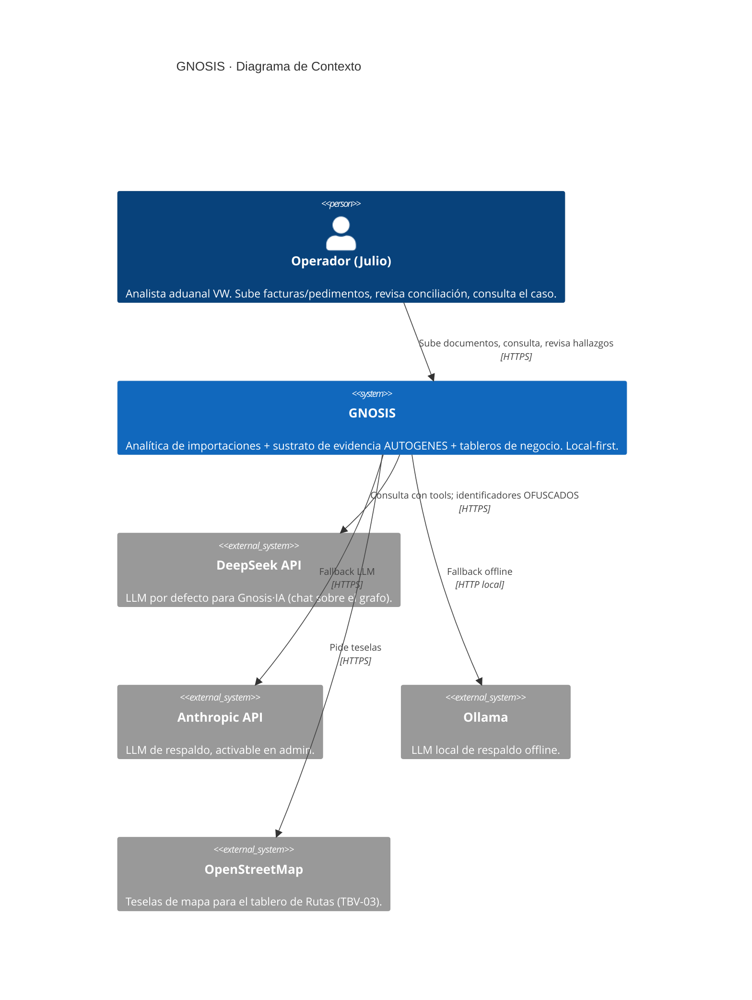
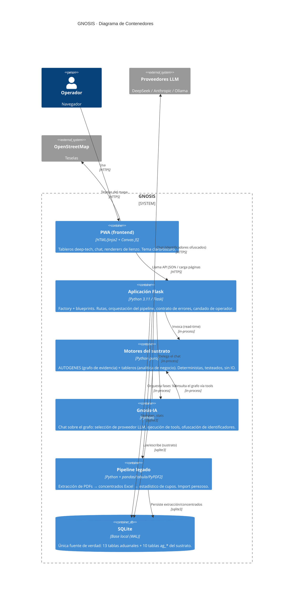
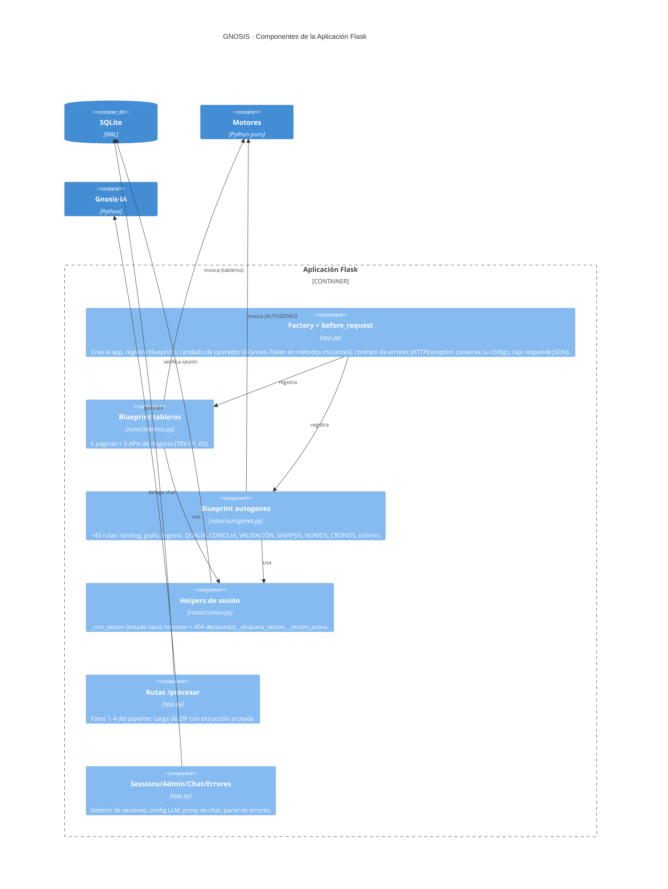
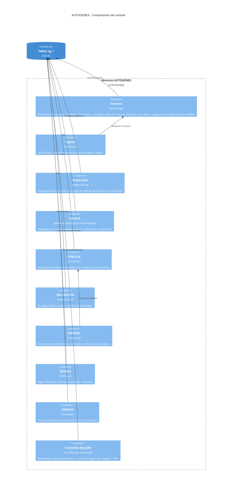
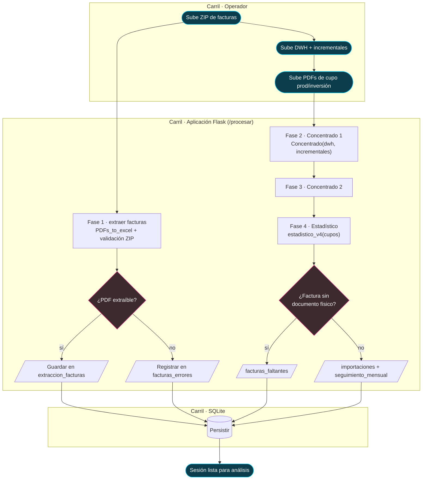
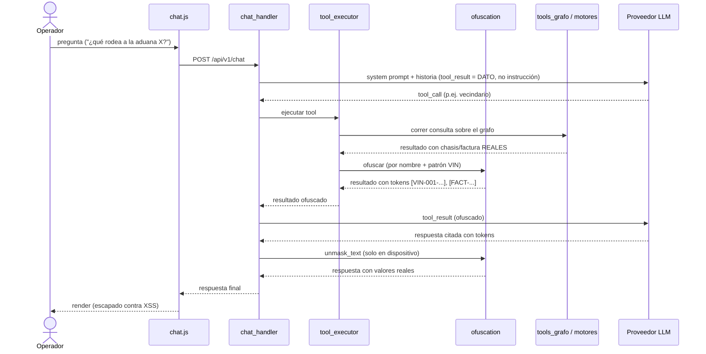
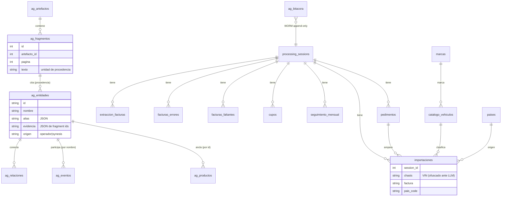
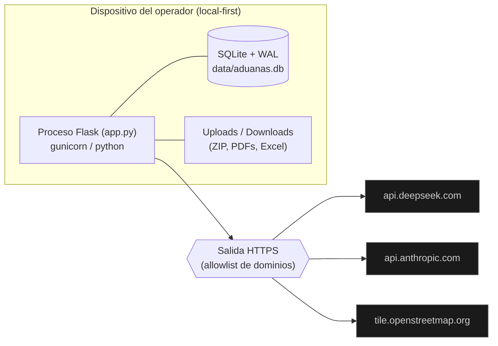

# Arquitectura de GNOSIS

Documentación de arquitectura del software siguiendo el **modelo C4**
(Context → Container → Component → Code) de Simon Brown, con vistas de
**proceso (BPMN-style)**, **modelo de datos (ER)**, **secuencia** y
**despliegue**. Los diagramas están en Mermaid (se renderizan en GitHub y
en cualquier visor Mermaid).

GNOSIS es un sistema de analítica de importaciones aduanales para el Grupo
Volkswagen México: extrae facturas y pedimentos (PDF), reconcilia contra el
DWH, y construye sobre ese dato un **sustrato de ontología unificada
(AUTOGENES)** — un grafo de evidencia con procedencia — más una capa de
inteligencia (LLM con ofuscación de identificadores) y tableros de negocio.

Principios rectores (ver también `AGENTS.md`): **ZERO SNAKE OIL** (todo
número es salida de motor; nada se estima ni se inventa), **ley de
procedencia** (toda entidad extraída cita su fragmento fuente), **sustrato
como único escritor** de las tablas `ag_*`, **bitácora WORM**, y
**ofuscación de identificadores** (chasis/factura) antes de exponerlos a un
LLM.

---

## C4 · Nivel 1 — Contexto del sistema

Quién usa GNOSIS y con qué sistemas externos habla.

**Nota de privacidad:** los identificadores sensibles (chasis/VIN, número de
factura, pedimento, patente) **nunca** viajan en claro a un LLM. La capa de
ofuscación (`jarvis/ofuscation.py`) los reemplaza por tokens reversibles
solo en el dispositivo.

---

## C4 · Nivel 2 — Contenedores

Las piezas ejecutables/desplegables y cómo se comunican. GNOSIS corre como
un proceso Flask monolítico con módulos internos bien separados.

### Mapa de código → contenedor

| Contenedor | Código |
|------------|--------|
| PWA | `templates/*.html`, `static/*.js` (renderers de canvas), `static/*.css` (tokens Gestell) |
| Aplicación Flask | `app.py` (factory, pipeline legado, sessions/admin/chat/errores), `rutas/` (blueprints `tableros`, `autogenes`, helpers `comun`) |
| Motores | `autogenes/` (sustrato + capacidades), `tableros/` (dominio, maduración, rechazos, cupo, rutas) |
| Gnosis·IA | `jarvis/` (llm_interface, tool_executor, tools, tools_grafo, ofuscation, prompts, quorum, chat_handler) |
| Pipeline legado | `PDFs_Final_v3.py`, `PDFs_v2.py`, `concentrado1.py`, `concentrado2.py`, `Estadistico.py` |
| SQLite | `database/` (models, models_autogenes, persistence, migrations, backup) |

---

## C4 · Nivel 3 — Componentes de la Aplicación Flask

Interior del contenedor Flask: las familias de rutas (blueprints) y los
cortes transversales.

## C4 · Nivel 3 — Componentes del sustrato AUTOGENES

El diferenciador: un grafo de evidencia con procedencia. `sustrato.py` es el
**único escritor** de las tablas `ag_*`; todo lo demás lee o propone.

---

## Proceso (BPMN-style) — Ingesta y procesamiento del pedimento

El pipeline de negocio en 4 fases, con carriles por actor. Notación
BPMN-style: `([inicio/fin])`, `[tarea]`, `{compuerta}`.

## Proceso (BPMN-style) — Consulta al caso vía Gnosis·IA (con ofuscación)

Cómo una pregunta del operador atraviesa el LLM sin filtrar identificadores.

---

## Modelo de datos (ER)

Dos mundos en la misma base: el **aduanal** (izquierda, alimentado por el
pipeline) y el **sustrato AUTOGENES** (`ag_*`, el grafo de evidencia). El
dato aduanal se *proyecta* al grafo en tiempo de lectura — no se duplica.

**Ley de procedencia:** una `ag_entidad` extraída de un documento **debe**
citar fragmentos (`evidencia`); las entidades de operador/conversación
llevan su `origen`. Un producto (informe, camino) que cita filas aduanales
lleva `evidencia=[]` — jamás fabrica evidencia documental.

---

## Vista de despliegue

- **Local-first:** el dato vive en SQLite en el dispositivo; nada se sube a
  un backend. Exportable como bundle JSON (`/api/v1/autogenes/exportar`).
- **Candado de operador:** con `GNOSIS_TOKEN` en el entorno, todo método
  mutante exige el header `X-Gnosis-Token`.
- **Salida de red:** allowlist de dominios (DeepSeek, Anthropic, OSM); sin
  fetch fuera de ella.
- **Config segura por defecto:** `debug` off y `host=127.0.0.1` salvo
  override explícito por entorno (`GNOSIS_DEBUG`, `GNOSIS_HOST`).

---

## Decisiones de arquitectura (resumen)

| Decisión | Racional |
|----------|----------|
| Monolito Flask con blueprints | Un solo operador, local-first; la separación se logra por módulos y blueprints (`rutas/`), no por servicios. |
| SQLite como única fuente de verdad (WAL) | Local-first, exportable, transaccional; el backup hace checkpoint del WAL antes de copiar. |
| Sustrato como único escritor de `ag_*` | Integridad de la procedencia y la bitácora WORM; los motores solo *proponen* o leen. |
| Proyección en tiempo de lectura | El dato aduanal no se duplica en el grafo; se proyecta al leer (una sola fuente). |
| Motores puros y deterministas | Testeables sin IO; ordenamientos estables (sin dependencia de PYTHONHASHSEED). |
| Ofuscación antes del LLM | Los identificadores (VIN/factura) nunca salen en claro; tokens reversibles solo en dispositivo. |
| Import perezoso del pipeline legado | La app y sus rutas importan sin el stack de data-science; CI corre la red HTTP con deps mínimas. |
| Contrato de errores honesto | HTTPException conserva su código; `/api` responde JSON; estado vacío = 404 declarado, no 500. |

Referencias: modelo C4 (c4model.com), BPMN 2.0 (OMG), arc42 para la
estructura del documento.
