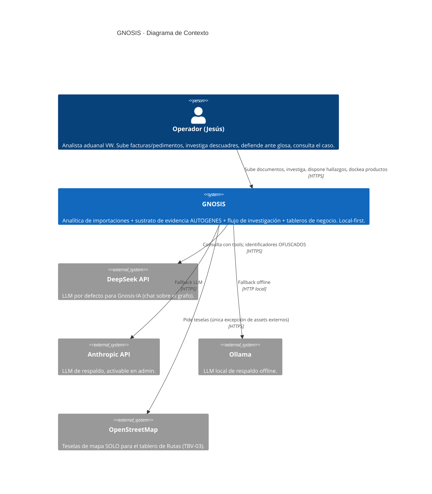
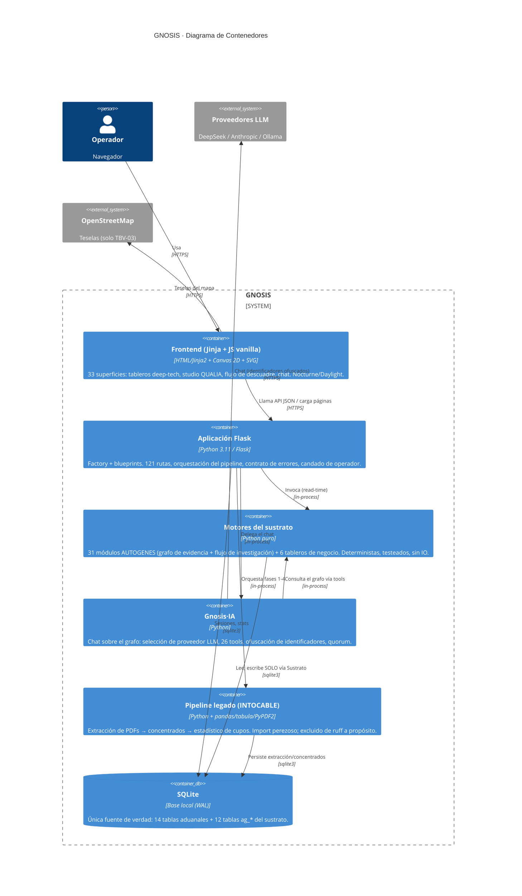
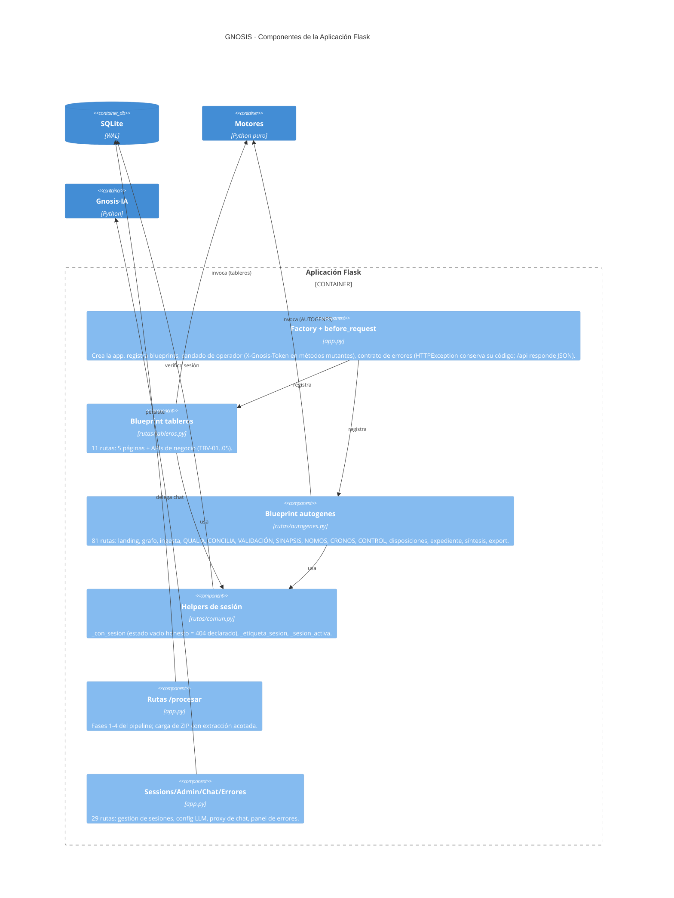
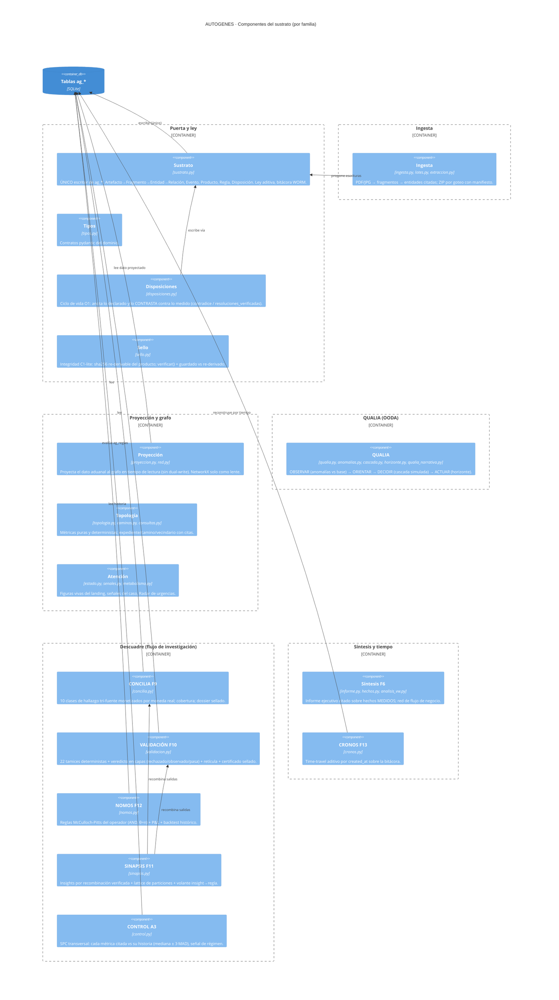
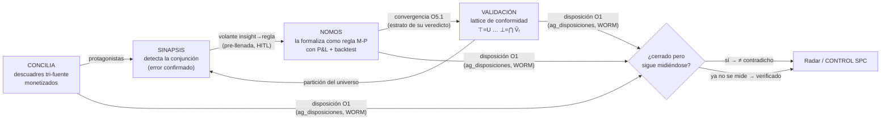
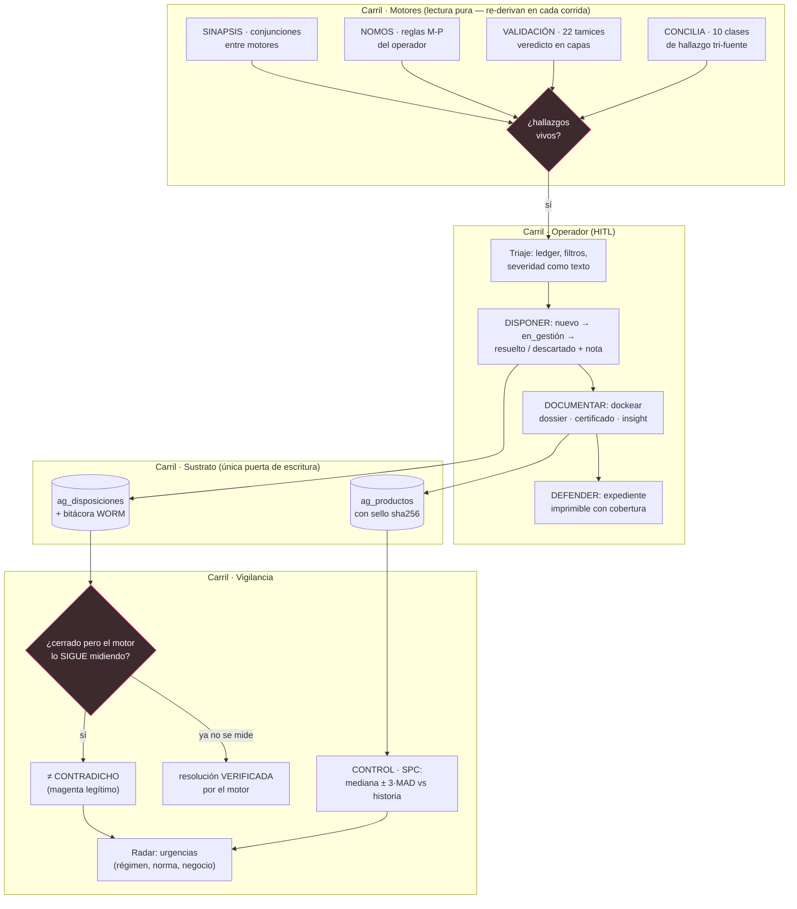
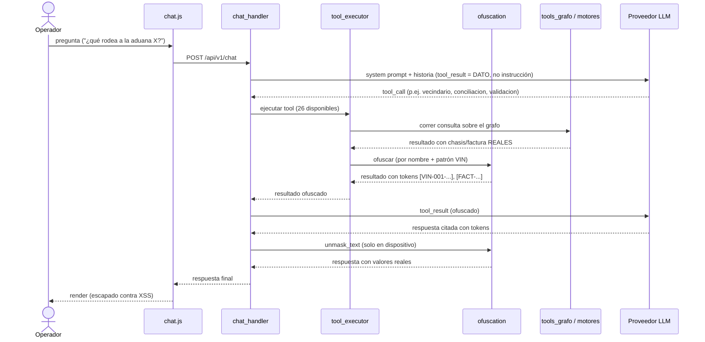
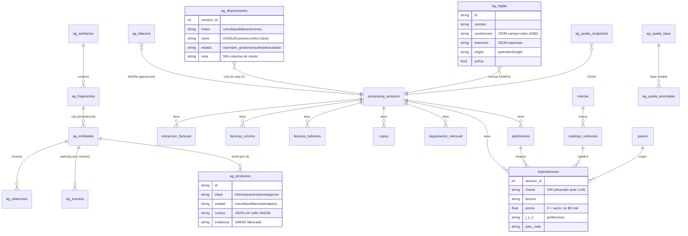
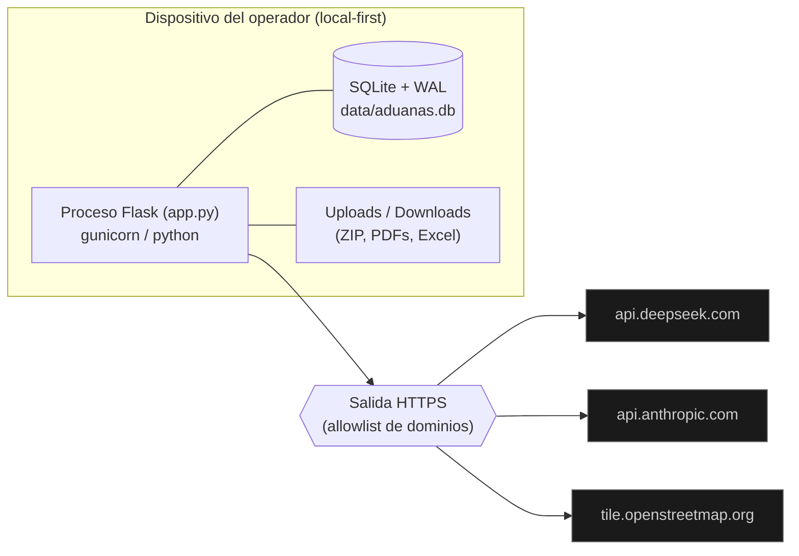

# Arquitectura de GNOSIS

Documentación de arquitectura del software siguiendo el **modelo C4**
(Context → Container → Component → Code) de Simon Brown, con vistas de
**proceso (BPMN-style)**, **modelo de datos (ER)**, **secuencia**,
**despliegue** y — porque el frontend es la mitad del sistema — un **mapa
completo de superficies visuales**. Los diagramas están en Mermaid (se
renderizan en GitHub y en cualquier visor Mermaid). Estructura del documento
según arc42.

GNOSIS es un sistema de analítica de importaciones aduanales para el Grupo
Volkswagen México: extrae facturas y pedimentos (PDF), reconcilia contra el
DWH, y construye sobre ese dato un **sustrato de ontología unificada
(AUTOGENES)** — un grafo de evidencia con procedencia — más un **flujo de
investigación** completo (detectar → disponer → documentar → defender →
vigilar), una capa de inteligencia (LLM con ofuscación de identificadores) y
tableros de negocio.

Principios rectores (ver también `CLAUDE.md`): **ZERO SNAKE OIL** (todo
número es salida de motor; nada se estima ni se inventa), **ley de
procedencia** (toda entidad extraída cita su fragmento fuente), **sustrato
como único escritor** de las tablas `ag_*`, **bitácora WORM**,
**determinismo del render** (el mismo grafo abre idéntico), y **ofuscación
de identificadores** (chasis/factura) antes de exponerlos a un LLM.

---

## Stack tecnológico

Stack deliberadamente corto — cada pieza está ahí por una decisión
registrada (§Decisiones), no por inercia.

| Capa | Tecnología | Papel | Dónde |
|------|-----------|-------|-------|
| Runtime | Python 3.11 | Todo el backend | — |
| Web | Flask (factory + blueprints) | 121 rutas: 81 AUTOGENES + 11 tableros + 29 shell/pipeline | `app.py`, `rutas/` |
| Datos | SQLite (WAL) — **única verdad** | 14 tablas aduanales + 12 tablas `ag_*` del sustrato | `database/` |
| Tipos | pydantic | Contratos del sustrato (Entidad, Producto, …) | `autogenes/tipos.py` |
| Grafo | NetworkX — **confinado** | Solo lentes de sesión (camino/vecindario/hubs); JAMÁS cifras de panel ni layout | `autogenes/red.py`, `caminos.py` |
| Ingesta | pandas / PyPDF2 / tabula | Bordes de ingesta y pipeline legado | `PDFs_*.py`, `concentrado*.py` |
| LLM | DeepSeek (def.) / Anthropic / Ollama | Gnosis·IA — chat con 26 tools sobre el grafo | `jarvis/` |
| Frontend | **JS vanilla** + Jinja2 — sin build step, sin framework, sin bundler | 33 superficies JS; canvas 2D para campos densos, SVG para diagramas | `static/`, `templates/` |
| Design system | GESTELL/PANOPTES — tokens CSS puros | AAA en ambos temas, magenta disciplinado, motion tokenizado | `static/styles.css` |
| Calidad | pytest (506) + ruff + eslint + CI GitHub Actions | Doble corrida para métricas; gate en cada push/PR | `tests/`, `.github/workflows/ci.yml` |

---

## C4 · Nivel 1 — Contexto del sistema

Quién usa GNOSIS y con qué sistemas externos habla.

**Nota de privacidad:** los identificadores sensibles (chasis/VIN, número de
factura, pedimento, patente) **nunca** viajan en claro a un LLM. La capa de
ofuscación (`jarvis/ofuscation.py`) los reemplaza por tokens reversibles
solo en el dispositivo.

---

## C4 · Nivel 2 — Contenedores

Las piezas ejecutables/desplegables y cómo se comunican. GNOSIS corre como
un proceso Flask monolítico con módulos internos bien separados.

### Mapa de código → contenedor

| Contenedor | Código |
|------------|--------|
| Frontend | `templates/*.html` (Jinja), `static/*.js` (renderers canvas/SVG), `static/*.css` (tokens GESTELL) |
| Aplicación Flask | `app.py` (factory, pipeline legado, sessions/admin/chat/errores), `rutas/` (blueprints `tableros`, `autogenes`, helpers `comun`) |
| Motores | `autogenes/` (sustrato + 30 capacidades), `tableros/` (dominio, maduración, rechazos, cupo, rutas, fechas) |
| Gnosis·IA | `jarvis/` (llm_interface, tool_executor, tools ×18, tools_grafo ×8, ofuscation, prompts, quorum, chat_handler) |
| Pipeline legado | `PDFs_Final_v3.py`, `PDFs_v2.py`, `concentrado1.py`, `concentrado2.py`, `Estadistico.py` — **no se tocan**; todo ajuste va en el borde |
| SQLite | `database/` (models, models_autogenes, persistence, migrations, backup) |

---

## C4 · Nivel 3 — Componentes de la Aplicación Flask

Interior del contenedor Flask: las familias de rutas (blueprints) y los
cortes transversales.

---

## C4 · Nivel 3 — Componentes del sustrato AUTOGENES

El diferenciador: un grafo de evidencia con procedencia **más el flujo de
investigación**. `sustrato.py` es el **único escritor** de las tablas
`ag_*`; todo lo demás lee o propone. Los 31 módulos se organizan en seis
familias:

### El acople del descuadre — un ciclo que aprende

Las piezas del flujo de investigación no son islas: forman un ciclo
cerrado donde el patrón detectado se vuelve norma y la norma se vuelve
veredicto.

---

## Mapa de superficies frontend

La mitad del sistema es visual. Cada superficie declara su **medio** (canvas
2D para campos densos y continuos; **SVG para diagramas** — donde el texto
truncado debe ser estructuralmente imposible; DOM para formas documentales)
y su **forma visual**. Todo color sale de tokens; el cambio de tema no
redibuja. Ningún render usa `Math.random` — el mismo grafo abre idéntico.

### Núcleo AUTOGENES

| Superficie | Ruta | JS | Medio | Forma visual | Datos |
|---|---|---|---|---|---|
| Constelación (landing) | `/autogenes` | `constelacion.js` | SVG | Constelación de figuras vivas, una por motor, con su métrica citada | `estado.py` |
| Radar | `/autogenes/radar` | `metabolismo.js` | canvas | Pools y reacciones del caso (Fuente→…→Producto), fugas accionables + urgencias | `metabolismo.py` |
| Vínculos (grafo) | `/autogenes/grafo`, `/vinculos` | `fuerzas.js` + `grafo.js` (+`vinculos.js`) | canvas | Grafo fuerza-dirigida **determinista**; Δ-nodos de descuadre; ghost-ink de dispuestos; deep-link `#n=` | `proyeccion.py` |
| Ingesta | `/autogenes/ingesta` | `chord.js` + `ingesta.js` | canvas + DOM | Acorde bipartito documento↔entidad; goteo de ZIP con manifiesto | `chord_ingesta.py`, `lotes.py` |
| Síntesis | `/autogenes/sintesis` | `sintesis.js` | canvas | Informe ejecutivo citado sobre hechos medidos | `informe.py`, `hechos.py` |
| CRONOS | `/autogenes/cronos` | `cronos.js` | canvas | Time-travel aditivo de la bitácora | `cronos.py` |
| Expediente | `/autogenes/expediente/<id>` | — (print-first) | DOM | Documento de defensa imprimible (`@media print`) con sello sha256 y cobertura | producto dockeado |

### Studio QUALIA (OODA)

Siete instrumentos canvas + dos capas compartidas: `qualia_dossier.js` (el
**cajón de dossier** con selección `?sel` que persiste entre pestañas) y
`qualia_export.js` (PNG/CSV).

| Instrumento | Fase OODA | Forma visual |
|---|---|---|
| `qualia.js` | OBSERVAR | Tablero de anomalías vs base medida |
| `qualia_terreno.js` | OBSERVAR | Terreno de anomalías |
| `qualia_orbe.js` | ORIENTAR | Orbe de centralidad (masas) |
| `qualia_cuerdas.js` | ORIENTAR | Cuerdas de comunidades |
| `qualia_deriva.js` | ORIENTAR | Deriva entre sesiones (drift) |
| `qualia_cascada.js` | DECIDIR | Cascada simulada (¿qué cae si cae X?) |
| `qualia_horizonte.js` | ACTUAR | Horizonte de eventos + telemetría de intervenciones |
| `qualia_maquina.js` | el bucle | La máquina OODA completa |

### Flujo de descuadre (investigación)

| Superficie | JS | Medio | Forma visual | Datos |
|---|---|---|---|---|
| CONCILIA | `concilia.js` + `ciclo_vida.js` + `control.js` | **SVG** + DOM | **Escalera de derivaciones P&ID**: espina VENDIDO→CONCILIADO→LLEGADO, cada fuga una estación FG con monto real; ciclo de vida O1 (ledger, filtros, ≠); cartas SPC | `concilia.py`, `control.py` |
| VALIDACIÓN | `validacion.js` + `ciclo_vida.js` + `control.js` | **SVG** + DOM | **Lattice de conformidad**: ⊤=U por dos rieles (DWH/PDF), tamices por estrato de veredicto, ⊥=⋂ V̄ᵣ; **retícula héroe** (una celda por fila, peor veredicto); ciclo O1 en la ficha; cartas SPC | `validacion.py`, `nomos.py`, `control.py` |
| NOMOS | `nomos.js` + `ciclo_vida.js` | canvas + DOM | **Neurona McCulloch-Pitts** de la regla (entradas→Σ→umbral→veredicto); P&L; backtest histórico; ciclo O1 | `nomos.py` |
| SINAPSIS | `sinapsis.js` | canvas + DOM | **Diamante del lattice de particiones** (⊤ → P·CONCILIA / P·VALIDACIÓN → ínfimo P∧P); tarjetas insight con cadena de composición; volante «formalizar regla» | `sinapsis.py` |
| VIN → dossier | `vin_dossier.js` | DOM | Todo VIN citado es enlace al cajón de dossier compartido; `?sel=` lo auto-abre | `consultas.py` |

### Tableros VW (negocio) y shell

| Superficie | JS | Medio | Forma visual |
|---|---|---|---|
| TBV-01 Dominio | `tbv_dominio.js` | canvas | Dominio de mercado por marca/modelo |
| TBV-02 Maduración | `tbv_maduracion.js` | canvas | Curvas de maduración de pedimentos |
| TBV-03 Rutas | `tbv_rutas.js` | canvas + OSM | Mapa de teselas con arcos de flujo por volumen |
| TBV-04 Rechazos | `tbv_rechazos.js` | canvas | Análisis de rechazos |
| TBV-05 Cupo | `tbv_cupo.js` | canvas | Consumo/proyección de cupos (`cupos_what_if`, método declarado) |
| Dashboard | `veredicto.js` + `constelacion.js` | SVG | Franja de veredicto + constelación |
| Chat Gnosis·IA | `chat.js` | DOM | Conversación con tools, render escapado contra XSS |
| Errores | — | DOM | Panel de curación de `facturas_errores` |

### Design system — GESTELL/PANOPTES (leyes visuales)

- **Solo tokens** (`static/styles.css`): cero hex/px crudos en componentes.
  Dos temas (Nocturne oscuro / Daylight claro) con contraste **AAA en
  ambos**; el toggle no redibuja porque el color vive en CSS.
- **Magenta disciplinado**: SOLO vía `--danger`/`--telos-on` — magenta =
  alerta real (violación, contradicción ≠), jamás decoración.
- **Motion desde tokens**; sin flashes >5 Hz; `prefers-reduced-motion`
  degrada a estático. Glows se apagan en Daylight (el trazo basta).
- **Accesibilidad**: severidad y estado siempre como TEXTO además de color;
  blancos de clic accesibles por teclado (`tabindex`, `role=button`);
  `aria-label` en todo diagrama.
- **Sin build step** (decisión registrada en `docs/EVALUACION_ESTANDAR_A.md`):
  JS vanilla servido por Jinja; nada de React/TS/Vite/Tailwind/bundler.

---

## Proceso (BPMN-style) — Ingesta y procesamiento del pedimento

El pipeline de negocio en 4 fases, con carriles por actor. Notación
BPMN-style: `([inicio/fin])`, `[tarea]`, `{compuerta}`.

## Proceso (BPMN-style) — El flujo de investigación

El hueco que `docs/BENCHMARK_PALANTIR.md` declaraba como el valor central de
Palantir, cerrado: **detectar → disponer → documentar → defender →
vigilar**. El diferenciador honesto está en la compuerta final: GNOSIS no
solo registra lo que el operador dice — **contrasta lo declarado contra lo
medido** en cada corrida.

## Proceso (BPMN-style) — Consulta al caso vía Gnosis·IA (con ofuscación)

Cómo una pregunta del operador atraviesa el LLM sin filtrar identificadores.

---

## Modelo de datos (ER)

Dos mundos en la misma base: el **aduanal** (alimentado por el pipeline) y
el **sustrato AUTOGENES** (`ag_*`, el grafo de evidencia + el flujo de
investigación). El dato aduanal se *proyecta* al grafo en tiempo de lectura
— no se duplica.

**Ley de procedencia:** una `ag_entidad` extraída de un documento **debe**
citar fragmentos (`evidencia`); las entidades de operador/conversación
llevan su `origen`. Un producto que cita filas aduanales lleva
`evidencia=[]` — jamás fabrica evidencia documental. **Ley del ciclo de
vida:** `ag_disposiciones` registra la decisión, nunca un monto — el monto
vive en el hallazgo del motor, derivado y citable a fila.

---

## Vista de despliegue

- **Local-first:** el dato vive en SQLite en el dispositivo; nada se sube a
  un backend. Exportable como bundle JSON (`/api/v1/autogenes/exportar`).
- **Candado de operador:** con `GNOSIS_TOKEN` en el entorno, todo método
  mutante exige el header `X-Gnosis-Token`.
- **Salida de red:** allowlist de dominios (DeepSeek, Anthropic, OSM); sin
  fetch fuera de ella.
- **Config segura por defecto:** `debug` off y `host=127.0.0.1` salvo
  override explícito por entorno (`GNOSIS_DEBUG`, `GNOSIS_HOST`).
- **Contenedores:** `docker/compose.yaml` (Podman) → `http://127.0.0.1:5001`.

## Calidad — gates y doctrina de prueba

| Gate | Herramienta | Regla |
|---|---|---|
| Lint Python | `ruff check .` | Limpio; el pipeline legado excluido a propósito |
| Lint JS | `npx eslint static` | 0 errores |
| Suite | `pytest tests/` (506 verdes + 4 gated por OCR) | 1:1 con los motores |
| Determinismo | test de **doble corrida** | Toda métrica nueva de panel: misma base ⇒ misma salida |
| CI | `.github/workflows/ci.yml` | ruff + pytest en cada push y PR |
| Visual | mock-first + captura Nocturne/Daylight | Ningún uplift visual sin visto bueno del operador |

---

## Decisiones de arquitectura (resumen)

| Decisión | Racional |
|----------|----------|
| Monolito Flask con blueprints | Un solo operador, local-first; la separación se logra por módulos y blueprints (`rutas/`), no por servicios. |
| SQLite como única fuente de verdad (WAL) | Local-first, exportable, transaccional; el backup hace checkpoint del WAL antes de copiar. |
| Sustrato como único escritor de `ag_*` | Integridad de la procedencia y la bitácora WORM; los motores solo *proponen* o leen. |
| Proyección en tiempo de lectura | El dato aduanal no se duplica en el grafo; se proyecta al leer (una sola fuente). |
| Motores puros y deterministas | Testeables sin IO; ordenamientos estables (sin dependencia de PYTHONHASHSEED). |
| NetworkX confinado a lentes | Cifras de panel y layout del render salen de código propio determinista; NetworkX solo responde camino/vecindario/hubs. |
| Ciclo de vida como CONTRASTE (O1) | No se registra solo lo que el operador dice: cada corrida contrasta lo declarado contra lo medido (≠ contradicho / verificado). Palantir registra; GNOSIS responde. |
| Sello sha256 re-derivable en productos | Un expediente de defensa es a prueba de manipulación: `verificar()` re-deriva y compara. |
| SPC con mediana ± 3·MAD | Banda robusta a outliers sobre historia real; jamás una confianza inventada. |
| Monetización honesta | `0` y `'0,00'` son campos vacíos/fabricados, no dinero; se declaran como «sin precio», nunca se estiman. |
| SVG para diagramas, canvas para campos | En SVG el texto truncado es estructuralmente imposible (escalera P&ID, lattice); canvas para campos densos (grafo, terreno, orbe). |
| Volante insight→regla con HITL | La regla llega derivada de filas reales y PRE-llenada, pero el operador la crea; solo se ofrece donde el insight es campo=valor. |
| Ofuscación antes del LLM | Los identificadores (VIN/factura) nunca salen en claro; tokens reversibles solo en dispositivo. |
| Import perezoso del pipeline legado | La app y sus rutas importan sin el stack de data-science; CI corre la red HTTP con deps mínimas. |
| Contrato de errores honesto | HTTPException conserva su código; `/api` responde JSON; estado vacío = 404 declarado, no 500. |
| Sin build step en el frontend | JS vanilla + Jinja (decisión registrada en `docs/EVALUACION_ESTANDAR_A.md`); cero dependencia de bundlers. |

Referencias: modelo C4 (c4model.com), BPMN 2.0 (OMG), arc42 para la
estructura del documento. Planes rectores: `docs/PROPUESTA_GRAFO.md`,
`docs/BENCHMARK_PALANTIR.md`, `docs/PLAN_CONCILIA_VALIDACION.md` (bitácora
del flujo de investigación), `docs/QUALIA_ARQUITECTURA.md` (detalle del
subsistema QUALIA).
