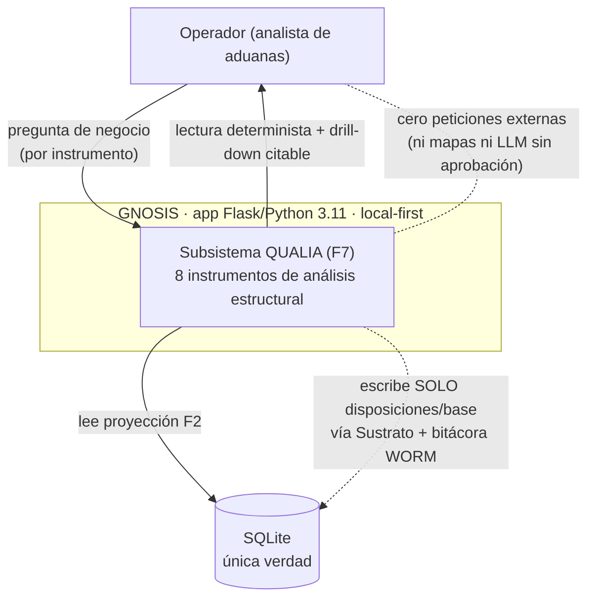
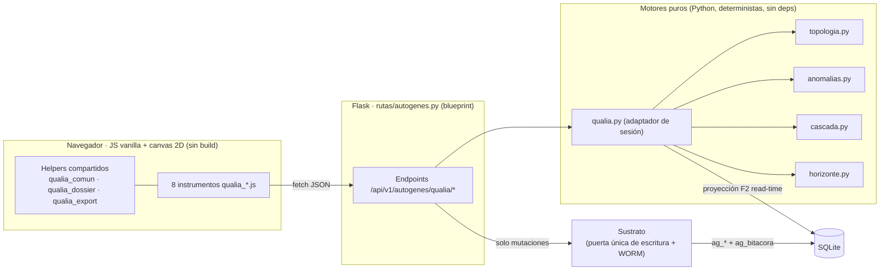
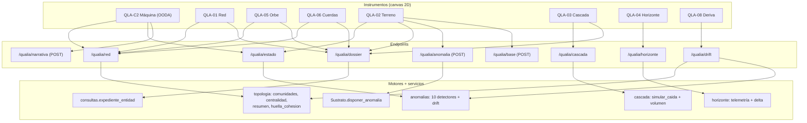
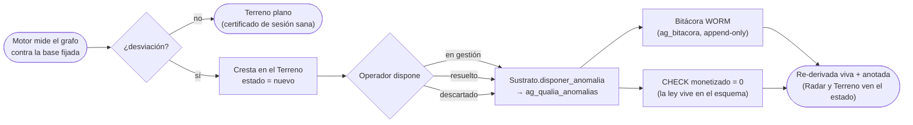
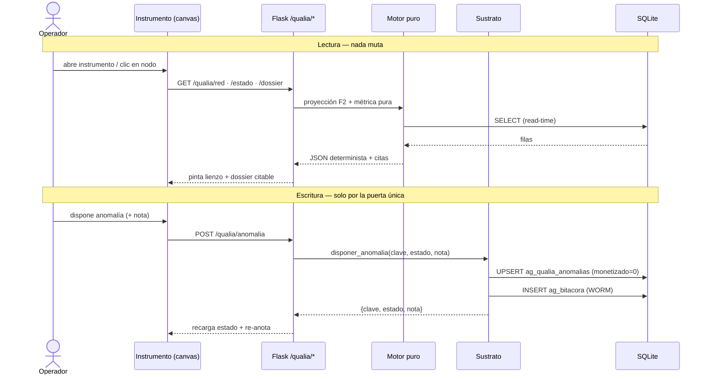
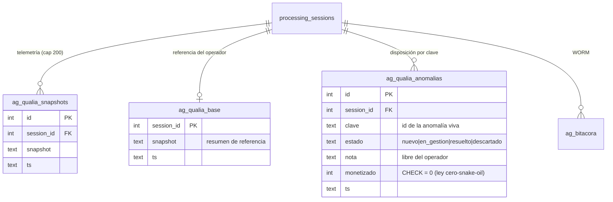

# QUALIA — Arquitectura (C4 · BPMN · ER · mapa de código)

**Subsistema:** AUTOGENES · F7 (QUALIA) tras el uplift Q0–Q7.
**Alcance:** los 8 instrumentos de la sala de control estructural, sus
endpoints, los motores puros que los alimentan y la puerta única de escritura.
**Leyes que gobiernan el subsistema** (ver `CLAUDE.md`): determinismo del
render · puerta única de escritura (`Sustrato`) · cero snake oil (ningún número
inventa monto; montos solo de CONCILIA/NOMOS) · local-first (cero red) · solo
tokens, magenta solo en alerta real, AAA en ambos temas.

> Los diagramas son Mermaid (se renderizan en GitHub). Las cajas de motor son
> **puras y deterministas**; la única flecha que escribe pasa por `Sustrato`.

---

## C4 · Nivel 1 — Contexto

## C4 · Nivel 2 — Contenedores

## C4 · Nivel 3 — Componentes (instrumento → endpoint → motor)

---

## BPMN — Ciclo de vida de una anomalía (Q5)

## Secuencia — lectura (drill-down) y escritura (disposición)

## ER — tablas propias de QUALIA (escritas solo por qualia.py/Sustrato)

---

## Mapa de código (todo comentado en estilo PANOPTES)

### Motores puros — deterministas, sin dependencias, con test de doble corrida
| Archivo | Responsabilidad | Ley clave |
|---|---|---|
| `autogenes/topologia.py` | Comunidades (propagación de etiquetas), centralidad de vector propio, resumen, escalera de agrupamiento, `persistencia_h0` → `huella_cohesion`. | Métrica de panel = pura + determinista |
| `autogenes/anomalias.py` | 10 detectores + `drift_topologico` (deriva entre sesiones). | Anomalía nunca monetiza |
| `autogenes/cascada.py` | `simular_caida`/`simular_enlace` what-if en memoria (volumen se compone en la ruta). | Nada escribe |
| `autogenes/horizonte.py` | Telemetría + intervenciones con delta medido entre muestras. | Nunca interpola |
| `autogenes/qualia.py` | Adaptador de sesión: proyección, telemetría (cap 200 + honestidad), base, `series_de_sesion`, `unidades_por_nodo`, `drift_sesiones`, anotación de ciclo de vida. | Lee F2, no la reconstruye |

### Escritura y consulta
| Archivo | Responsabilidad |
|---|---|
| `autogenes/sustrato.py` | Puerta única. `disponer_anomalia` (ciclo de vida + WORM), `fijar_base`. |
| `autogenes/consultas.py` | `expediente_entidad` (dossier citado fragmento→página→PDF). |
| `autogenes/senales.py` · `metabolismo.py` | Radar: publica anomalías + **deriva** entre sesiones como urgencia. |
| `rutas/autogenes.py` | Blueprint: 8 páginas + endpoints `/api/v1/autogenes/qualia/*`. |
| `database/models_autogenes.py` | Esquema `ag_qualia_*` (la ley `CHECK monetizado=0` vive aquí). |

### Instrumentos (JS vanilla + canvas 2D) y helpers
| Archivo | Instrumento / rol |
|---|---|
| `static/qualia.js` | QLA-01 Red — comunidades cósmicas + tendones por el núcleo + inset. |
| `static/qualia_terreno.js` | QLA-02 Terreno — 10 detectores, crestas, **ciclo de vida**. |
| `static/qualia_cascada.js` | QLA-03 Cascada — what-if radial + **volumen afectado**. |
| `static/qualia_horizonte.js` | QLA-04 Horizonte — osciloscopio con eje absoluto + honestidad del cap. |
| `static/qualia_orbe.js` | QLA-05 Orbe — sistema orbital luminoso por peso en la red. |
| `static/qualia_cuerdas.js` | QLA-06 Cuerdas — auroras por comunidad. |
| `static/qualia_maquina.js` | QLA-C2 Máquina — diagrama de acoples OODA (Feynman). |
| `static/qualia_deriva.js` | QLA-08 Deriva — dos núcleos + eje divergente + huella de cohesión. |
| `static/qualia_comun.js` | Helpers puros: esc, alfa, leerColores (fallback por tema), medir (DPR), brackets, alTema. |
| `static/qualia_dossier.js` | Cajón de dossier compartido (drill-down + `?sel=` cross-pestaña). |
| `static/qualia_export.js` | PNG exhibit + CSV con pie de fuente, en los 8. |
| `static/qualia.css` | Tokens del subsistema (magenta solo `--danger`/`--telos-on`). |

### Tests (1:1 con el motor; doble corrida para métricas nuevas)
`tests/test_topologia.py` · `test_anomalias.py` · `test_cascada_volumen.py` ·
`test_qualia.py` · `test_qualia_rutas.py` · `test_qualia_copy.py` (ratchet de
idioma) · `test_metabolismo.py` (deriva→Radar).
