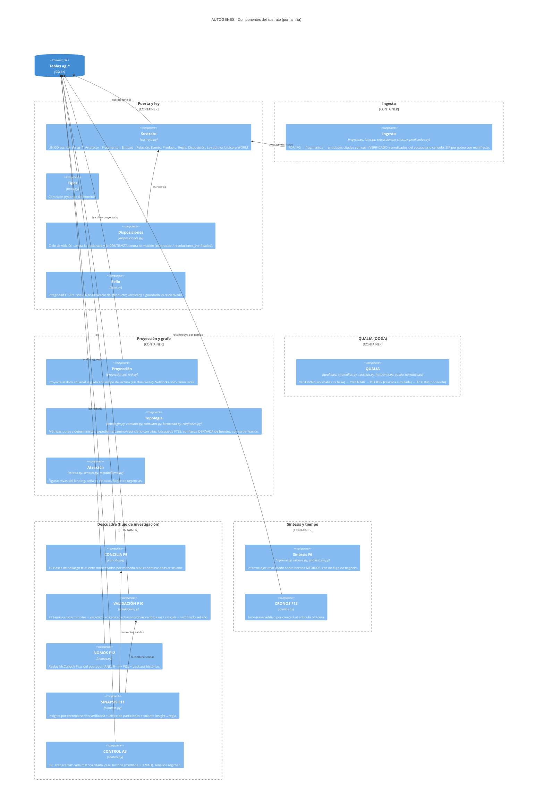
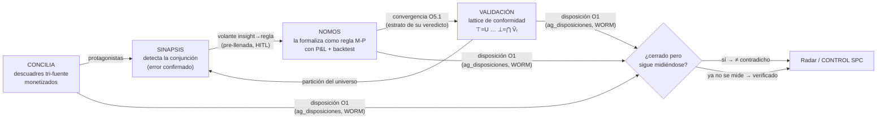

# C4 L3 · Componentes del sustrato AUTOGENES

> **Nivel:** C4 L3 · Componentes — **Notación:** C4 (Mermaid `C4Component`)
> **Pregunta que responde:** ¿Qué hay dentro del sustrato: qué motores lo componen y cómo se encadenan en el flujo de investigación?
> **Leyenda:** `Person` actor humano · `System`/`Container`/`Component` caja del sistema · `System_Ext` sistema externo (fuera de nuestro control) · `ContainerDb` almacén · `Rel` arista dirigida y etiquetada con protocolo.
> **ADR:** [ADR-0004](../adr/0004-sustrato-unico-escritor-de-ag.md) · [ADR-0005](../adr/0005-networkx-confinado-a-lentes.md) · [ADR-0006](../adr/0006-proyeccion-en-tiempo-de-lectura.md) · [ADR-0013](../adr/0013-sello-bajo-candado.md) · [ADR-0015](../adr/0015-proyeccion-acotada-y-cacheada.md) · [ADR-0016](../adr/0016-busqueda-de-texto-con-fts5.md) · [ADR-0017](../adr/0017-vocabulario-span-y-confianza-derivada.md)
> **Índice de vistas:** [docs/architecture/README.md](../README.md)

**Nota de la vista.** Caja blanca de `Container(motores)` del L2. Excede las ~6 cajas que pide la doctrina: el sustrato ES el diferenciador del sistema y partirlo escondería el encadenamiento. Desviación declarada, no descuido.

El diferenciador: un grafo de evidencia con procedencia **más el flujo de
investigación**. `sustrato.py` es el **único escritor** de las tablas
`ag_*`; todo lo demás lee o propone. Los 35 módulos se organizan en seis
familias:

### El acople del descuadre — un ciclo que aprende

Las piezas del flujo de investigación no son islas: forman un ciclo
cerrado donde el patrón detectado se vuelve norma y la norma se vuelve
veredicto.

