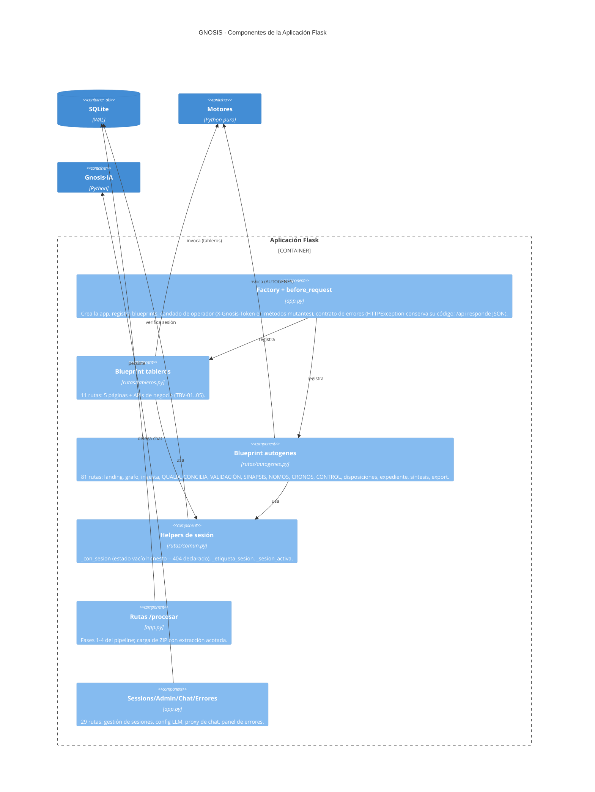

# C4 L3 · Componentes de la Aplicación Flask

> **Nivel:** C4 L3 · Componentes — **Notación:** C4 (Mermaid `C4Component`)
> **Pregunta que responde:** ¿Qué hay dentro del contenedor Flask: qué familias de rutas existen y qué cortes transversales las atraviesan?
> **Leyenda:** `Person` actor humano · `System`/`Container`/`Component` caja del sistema · `System_Ext` sistema externo (fuera de nuestro control) · `ContainerDb` almacén · `Rel` arista dirigida y etiquetada con protocolo.
> **ADR:** [ADR-0002](../adr/0002-monolito-flask-con-blueprints.md) · [ADR-0012](../adr/0012-estado-conversacional-en-sqlite.md)
> **Índice de vistas:** [docs/architecture/README.md](../README.md)

**Nota de la vista.** Caja blanca de `Container(flask)` del L2; todo lo demás queda como referencia externa nombrada.

Interior del contenedor Flask: las familias de rutas (blueprints) y los
cortes transversales.

