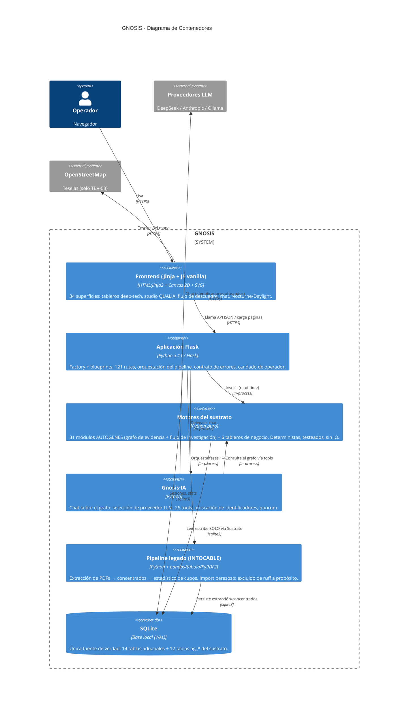

# C4 L2 · Contenedores

> **Nivel:** C4 L2 · Contenedores — **Notación:** C4 (Mermaid `C4Container`)
> **Pregunta que responde:** ¿Cuáles son las piezas ejecutables de GNOSIS y cómo se comunican entre sí?
> **Leyenda:** `Person` actor humano · `System`/`Container`/`Component` caja del sistema · `System_Ext` sistema externo (fuera de nuestro control) · `ContainerDb` almacén · `Rel` arista dirigida y etiquetada con protocolo.
> **ADR:** [ADR-0002](adr/0002-monolito-flask-con-blueprints.md) · [ADR-0003](adr/0003-sqlite-como-unica-verdad.md) · [ADR-0008](adr/0008-sin-build-step-en-el-frontend.md)
> **Índice de vistas:** [docs/architecture/README.md](README.md)

**Nota de la vista.** Caja blanca de `System(gnosis)` del L1. Las aristas que cruzan la frontera coinciden con las del L1 (ley de caja blanca, §4 de la doctrina).

Las piezas ejecutables/desplegables y cómo se comunican. GNOSIS corre como
un proceso Flask monolítico con módulos internos bien separados.

### Mapa de código → contenedor

| Contenedor | Código |
|------------|--------|
| Frontend | `templates/*.html` (Jinja), `static/*.js` (renderers canvas/SVG), `static/*.css` (tokens GESTELL) |
| Aplicación Flask | `app.py` (factory, pipeline legado, sessions/admin/chat/errores), `rutas/` (blueprints `tableros`, `autogenes`, helpers `comun`) |
| Motores | `autogenes/` (sustrato + 30 capacidades), `tableros/` (dominio, maduración, rechazos, cupo, rutas, fechas) |
| Gnosis·IA | `jarvis/` (llm_interface, tool_executor, tools ×18, tools_grafo ×8, ofuscation, prompts, quorum, chat_handler) |
| Pipeline legado | `PDFs_Final_v3.py`, `PDFs_v2.py`, `concentrado1.py`, `concentrado2.py`, `Estadistico.py` — **no se tocan**; todo ajuste va en el borde |
| SQLite | `database/` (models, models_autogenes, persistence, migrations, backup) |
