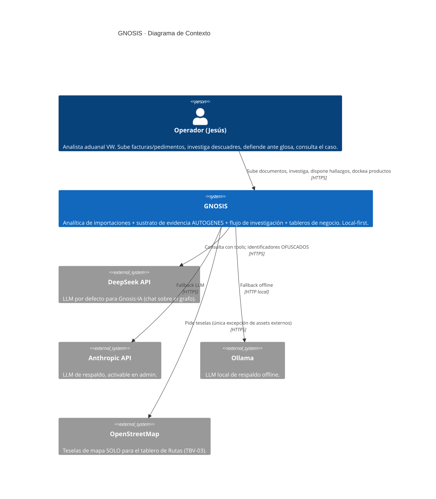

# C4 L1 · Contexto del sistema

> **Nivel:** C4 L1 · Contexto — **Notación:** C4 (Mermaid `C4Context`)
> **Pregunta que responde:** ¿Qué es GNOSIS en su entorno: quién lo usa y con qué sistemas externos habla?
> **Leyenda:** `Person` actor humano · `System`/`Container`/`Component` caja del sistema · `System_Ext` sistema externo (fuera de nuestro control) · `ContainerDb` almacén · `Rel` arista dirigida y etiquetada con protocolo.
> **ADR:** [ADR-0002](adr/0002-monolito-flask-con-blueprints.md) · [ADR-0007](adr/0007-ofuscacion-antes-del-llm.md)
> **Índice de vistas:** [docs/architecture/README.md](README.md)

**Nota de la vista.** Único diagrama de caja negra: GNOSIS aparece sin interior. Los niveles siguientes lo abren de una caja a la vez.

Quién usa GNOSIS y con qué sistemas externos habla.

**Nota de privacidad:** los identificadores sensibles (chasis/VIN, número de
factura, pedimento, patente) **nunca** viajan en claro a un LLM. La capa de
ofuscación (`jarvis/ofuscation.py`) los reemplaza por tokens reversibles
solo en el dispositivo.
