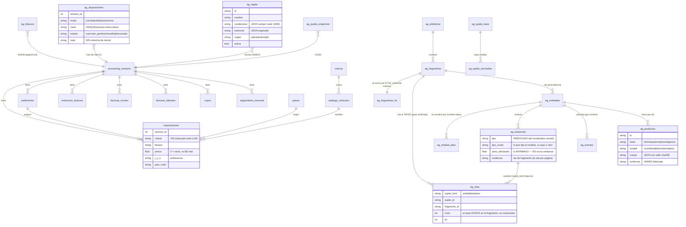

# Modelo de datos (ER)

> **Nivel:** Suplementario · datos — **Notación:** Mermaid `erDiagram`
> **Pregunta que responde:** ¿Qué tablas existen, cuáles son aduanales y cuáles del sustrato, y cómo se relacionan?
> **Leyenda:** `||--o{` = uno a muchos · `}o--o{` = muchos a muchos · prefijo `ag_` = tabla del sustrato AUTOGENES; el resto es aduanal. `ag_entidad_alias` y `ag_fragmentos_fts` son ÍNDICES, no evidencia: se derivan de `ag_entidades` y `ag_fragmentos` y se reconstruyen desde ellas. `ag_citas` SÍ es evidencia: el trozo verificado que sostiene una afirmación.
> **ADR:** [ADR-0003](adr/0003-sqlite-como-unica-verdad.md) · [ADR-0004](adr/0004-sustrato-unico-escritor-de-ag.md) · [ADR-0006](adr/0006-proyeccion-en-tiempo-de-lectura.md) · [ADR-0014](adr/0014-resolucion-de-entidad-por-indice.md) · [ADR-0016](adr/0016-busqueda-de-texto-con-fts5.md) · [ADR-0017](adr/0017-vocabulario-span-y-confianza-derivada.md)
> **Índice de vistas:** [docs/architecture/README.md](README.md)

**Nota de la vista.** 28 entidades: muy por encima de las ~6 de una vista C4. Un modelo ER no es una vista C4 y su valor está en la completitud; desviación declarada.

Dos mundos en la misma base: el **aduanal** (alimentado por el pipeline) y
el **sustrato AUTOGENES** (`ag_*`, el grafo de evidencia + el flujo de
investigación). El dato aduanal se *proyecta* al grafo en tiempo de lectura
— no se duplica.

**Los dos índices derivados.** `ag_entidad_alias` (una fila por nombre y
por alias, `PRIMARY KEY (session_id, alias_norm)`) resuelve la identidad sin
escanear; `ag_fragmentos_fts` (FTS5 de **contenido externo**, mantenido por
tres triggers) busca texto sin duplicarlo. Ninguno es evidencia: los dos se
reconstruyen desde su tabla real, así que quedan fuera de la ley de
procedencia y su relleno corre en migración, sin bitácora.

**Ley de la confianza:** `ag_relaciones` no guarda ninguna confianza. Guarda
`peso_declarado` —lo que afirmó quien propuso la arista— y la confianza se
DERIVA al leer (`autogenes/confianza.py`) contando artefactos distintos que
la citan, con su derivación al lado. Misma doctrina que la proyección
(ADR-0006): lo derivable no se almacena.

**Ley de procedencia:** una `ag_entidad` extraída de un documento **debe**
citar fragmentos (`evidencia`); las entidades de operador/conversación
llevan su `origen`. Un producto que cita filas aduanales lleva
`evidencia=[]` — jamás fabrica evidencia documental. **Ley del ciclo de
vida:** `ag_disposiciones` registra la decisión, nunca un monto — el monto
vive en el hallazgo del motor, derivado y citable a fila.
