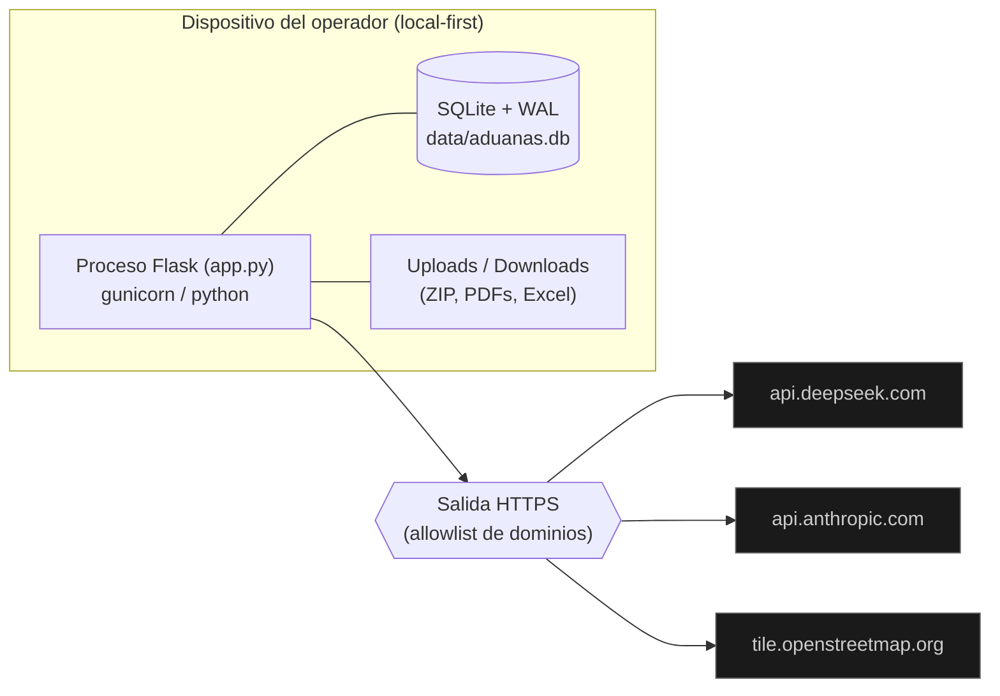

# Vista de despliegue

> **Nivel:** Despliegue — **Notación:** Mermaid `flowchart LR`
> **Pregunta que responde:** ¿Dónde corre cada pieza y qué cruza la frontera de la máquina del operador?
> **Leyenda:** Gris = sistema externo · el resto vive dentro del contenedor del operador.
> **ADR:** [ADR-0002](adr/0002-monolito-flask-con-blueprints.md) · [ADR-0003](adr/0003-sqlite-como-unica-verdad.md)
> **Índice de vistas:** [docs/architecture/README.md](README.md)

- **Local-first:** el dato vive en SQLite en el dispositivo; nada se sube a
  un backend. Exportable como bundle JSON (`/api/v1/autogenes/exportar`).
- **Candado de operador:** con `GNOSIS_TOKEN` en el entorno, todo método
  mutante exige el header `X-Gnosis-Token`.
- **Salida de red:** allowlist de dominios (DeepSeek, Anthropic, OSM); sin
  fetch fuera de ella.
- **Config segura por defecto:** `debug` off y `host=127.0.0.1` salvo
  override explícito por entorno (`GNOSIS_DEBUG`, `GNOSIS_HOST`).
- **Contenedores:** `docker/compose.yaml` (Podman) → `http://127.0.0.1:5001`.
