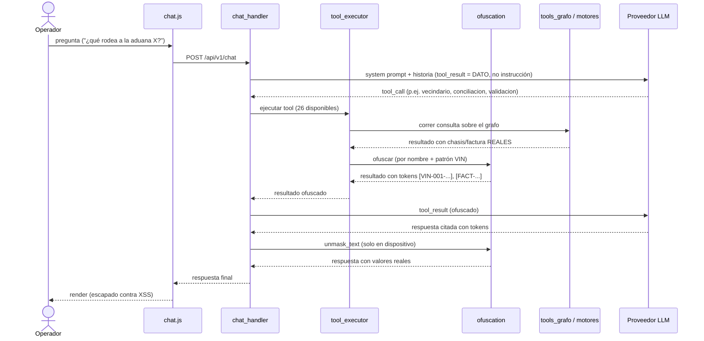

# Proceso · Consulta al caso vía Gnosis·IA

> **Nivel:** Interacción ordenada en el tiempo — **Notación:** Mermaid `sequenceDiagram`
> **Pregunta que responde:** ¿Cómo atraviesa una pregunta del operador la capa LLM sin que un identificador salga en claro?
> **Leyenda:** Participantes en columnas; el tiempo baja. Cada flecha es un mensaje etiquetado; la ofuscación ocurre ANTES de cruzar a la derecha.
> **ADR:** [ADR-0007](../adr/0007-ofuscacion-antes-del-llm.md)
> **Índice de vistas:** [docs/architecture/README.md](../README.md)

Cómo una pregunta del operador atraviesa el LLM sin filtrar identificadores.

