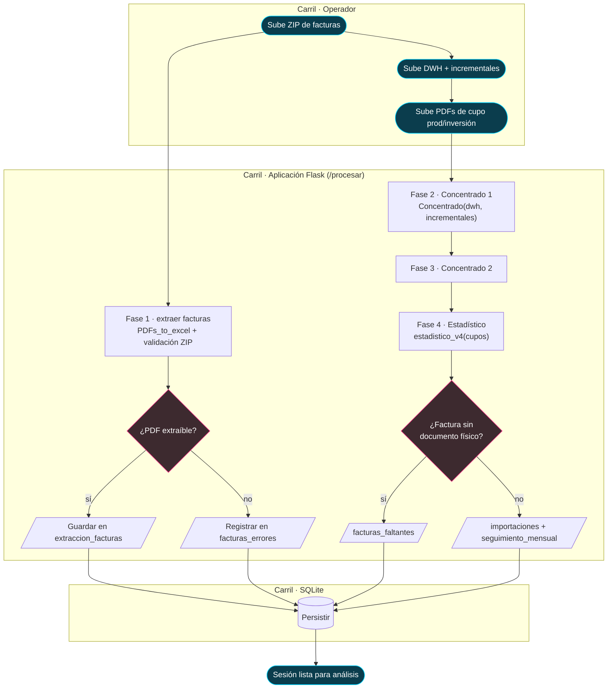

# Proceso · Ingesta y procesamiento del pedimento

> **Nivel:** Proceso (BPMN-style) — **Notación:** Mermaid `flowchart TB` con carriles por actor
> **Pregunta que responde:** ¿Cómo viaja un pedimento desde el PDF que sube el operador hasta las tablas aduanales?
> **Leyenda:** Cian = inicio/fin · **magenta = compuerta de decisión** · rectángulo = actividad · `/…/` = artefacto de datos.
> **ADR:** [ADR-0003](../adr/0003-sqlite-como-unica-verdad.md)
> **Índice de vistas:** [docs/architecture/README.md](../README.md)

El pipeline de negocio en 4 fases, con carriles por actor. Notación
BPMN-style: `([inicio/fin])`, `[tarea]`, `{compuerta}`.

