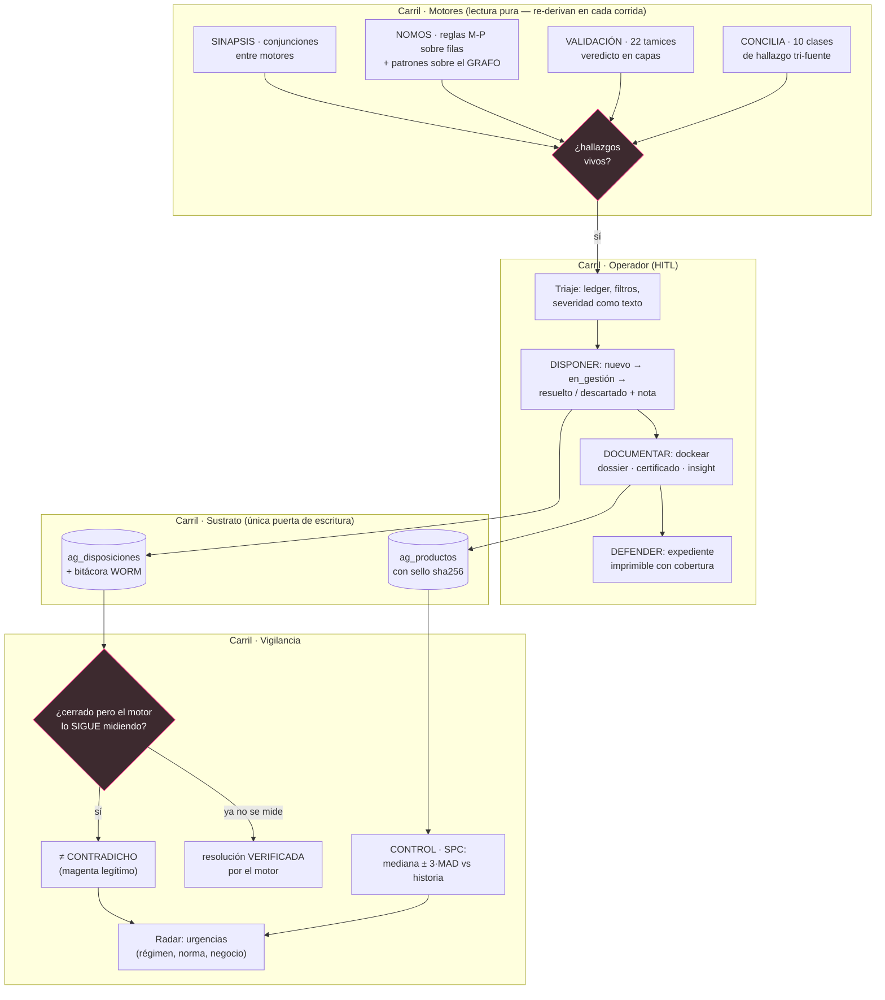

# Proceso · El flujo de investigación

> **Nivel:** Proceso (BPMN-style) — **Notación:** Mermaid `flowchart TB`
> **Pregunta que responde:** ¿Cómo pasa un descuadre de detectado a defendido, y cómo realimenta al sistema?
> **Leyenda:** **Magenta = compuerta de decisión** (hallazgo / contradicción) · rectángulo = actividad · el ciclo cierra sobre sí mismo: lo dispuesto vuelve como contraste.
> **ADR:** [ADR-0004](../adr/0004-sustrato-unico-escritor-de-ag.md) · [ADR-0019](../adr/0019-tiempo-event-log-y-reglas-de-grafo.md)
> **Índice de vistas:** [docs/architecture/README.md](../README.md)

El hueco que `docs/BENCHMARK_PALANTIR.md` declaraba como el valor central de
Palantir, cerrado: **detectar → disponer → documentar → defender →
vigilar**. El diferenciador honesto está en la compuerta final: GNOSIS no
solo registra lo que el operador dice — **contrasta lo declarado contra lo
medido** en cada corrida.

